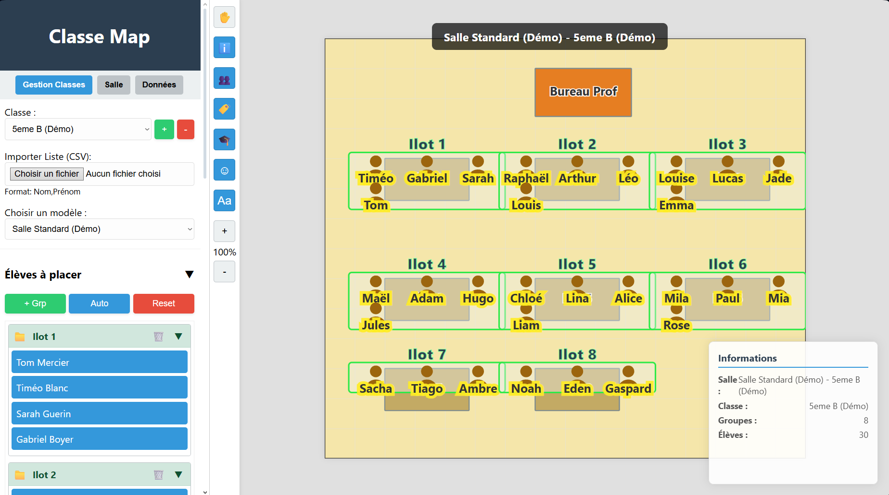

# Classe Map

**Classe Map** est une application web interactive permettant aux enseignants de créer, gérer et visualiser des plans de classe dynamiques. Elle offre des outils pour dessiner la configuration de la salle, importer des listes d'élèves et organiser les placements par groupes ou individuellement.

## Fonctionnalités Principales

### 1. Gestion des Classes
*   **Création et Suppression :** Ajoutez et supprimez facilement des classes (ex: 6ème A, 3ème B).
*   **Import CSV :** Importez vos listes d'élèves via un fichier CSV simple.
    *   *Format supporté :* `Nom,Prénom` ou `Nom,Prénom,Groupe`.
*   **Association de Modèle :** Liez chaque classe à un modèle de salle spécifique (Labo, Salle Info, etc.).

### 2. Éditeur de Salle (Modèles)
Créez des configurations de salle réutilisables :
*   **Configuration de la pièce :** Définissez les dimensions de la salle et la couleur du sol.
*   **Ajout de Mobilier :**
    *   Tables rectangulaires et rondes.
    *   Postes informatiques.
    *   Séparateurs / Murs.
*   **Personnalisation :** Modifiez la taille, la couleur et l'orientation (rotation) des objets.
*   **Métadonnées :** Ajoutez des informations textuelles sur les tables (ex: Numéro de poste), visibles en permanence ou au survol.

### 3. Placement des Élèves
*   **Drag & Drop :** Glissez les élèves depuis la liste latérale directement sur le plan.
*   **Magnétisme (Snap) :** Les élèves "s'aimantent" automatiquement aux tables lors du relâchement pour un alignement parfait.
*   **Gestion des Groupes :**
    *   **Création :** Créez des groupes manuellement ou utilisez la **génération automatique** (groupes aléatoires de 3-4 élèves).
    *   **Visualisation :** Les groupes sur le plan sont entourés d'une forme colorée.
    *   **Formes dynamiques :** Double-cliquez sur un groupe sur le plan pour changer sa forme (Rectangle, Carré, Cercle).
    *   **Déplacement groupé :** Déplacez tous les élèves d'un groupe en une seule fois.
    *   **Génération Auto :** Répartissez aléatoirement les élèves en groupes de 3-4 via le bouton "Auto".
    *   **Reset Groupes :** Le bouton "Reset" replace tous les élèves dans le groupe principal "Master".

### 4. Navigation et Visualisation
*   **Zoom et Panoramique :** Zoomez pour voir les détails ou dézoomez pour une vue d'ensemble. Utilisez l'outil "Main" pour vous déplacer dans le plan.
*   **Panneau d'Informations :**
    *   Affiche en temps réel le nom de la salle, de la classe, et les compteurs (groupes/élèves).
    *   Affiche le nom complet de l'élève au survol de la souris.
    *   Peut être masqué via la barre d'outils.
*   **Barre d'outils d'affichage :** Contrôlez précisément ce qui est visible sur le plan :
    *   👥 **Groupes (Global) :** Affiche/Masque l'ensemble des groupes et élèves.
    *   🏷️ **Étiquettes :** Affiche/Masque uniquement les titres des groupes.
    *   🎓 **Élèves :** Affiche/Masque les élèves (icônes + noms).
    *   ☺ **Icônes :** Affiche/Masque uniquement les avatars graphiques.
    *   Aa **Noms :** Affiche/Masque uniquement les prénoms des élèves.

### 5. Gestion des Données
*   **Sauvegarde Locale :** Toutes les modifications sont sauvegardées automatiquement dans le navigateur (LocalStorage).
*   **Export JSON :** Exportez toutes vos données (modèles et classes) dans un fichier JSON pour les sauvegarder ou les transférer.
*   **Import JSON :** Restaurez vos données via un simple glisser-déposer dans l'onglet "Données".
*   **Actions Rapides :**
    *   **Charger Démo :** Génère des modèles (Salle Standard, Salle Info) et des classes exemples (6ème A, 5ème B) pour tester l'application.
    *   **Réinitialiser Tout :** Efface toutes les données (Modèles et Classes) pour repartir à zéro.

## Guide d'utilisation rapide

1.  Ouvrez `index.html` dans un navigateur web moderne.
2.  Allez dans l'onglet **Salle** pour créer la disposition de votre classe (tables, bureau prof, etc.) et sauvegardez le modèle.
3.  Allez dans l'onglet **Gestion Classes**, créez une nouvelle classe et sélectionnez le modèle que vous venez de créer.
4.  Importez une liste d'élèves (CSV) ou créez des groupes manuellement.
5.  Glissez les élèves sur le plan pour les placer.

## Structure du projet

*   `index.html` : Structure principale de l'interface.
*   `styles.css` : Styles et mise en page (Flexbox, positionnement absolu pour le plan).
*   `app.js` : Logique de l'application (Manipulation SVG, Drag&Drop, Gestion des données).

## Raccourcis et Astuces

*   **Double-clic sur un groupe (Plan) :** Change la forme du fond du groupe.
*   **Double-clic sur un nom de groupe (Sidebar) :** Renommer le groupe.
*   **Ctrl + Clic (Mode Édition Salle) :** Sélection multiple d'objets.
*   **Double-clic sur un objet (Mode Édition Salle) :** Supprimer l'objet.

---
*Développé pour l'Éducation Nationale - Technologie*